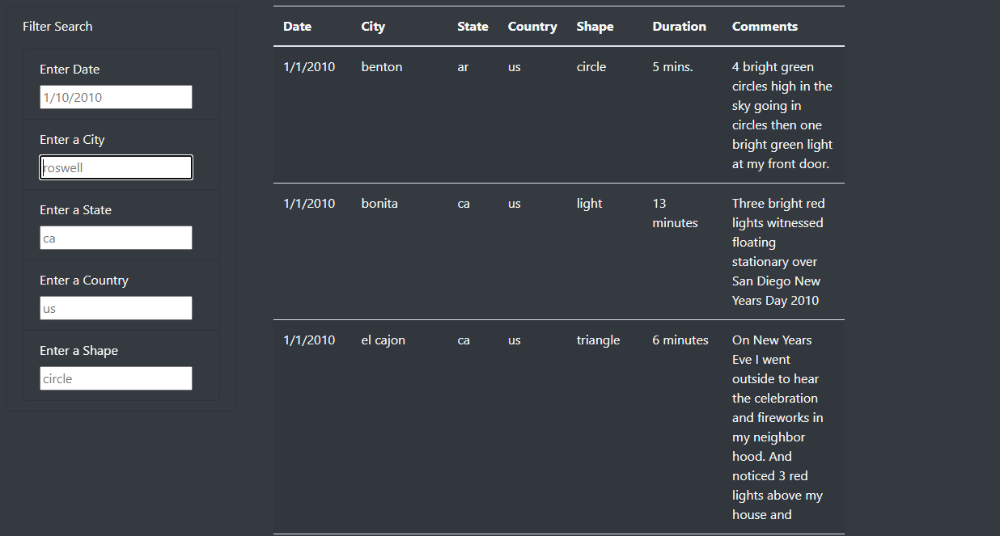
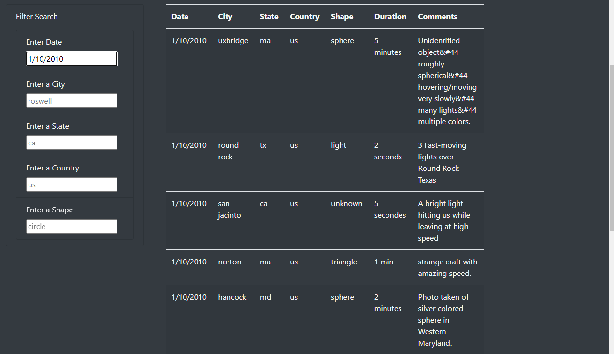
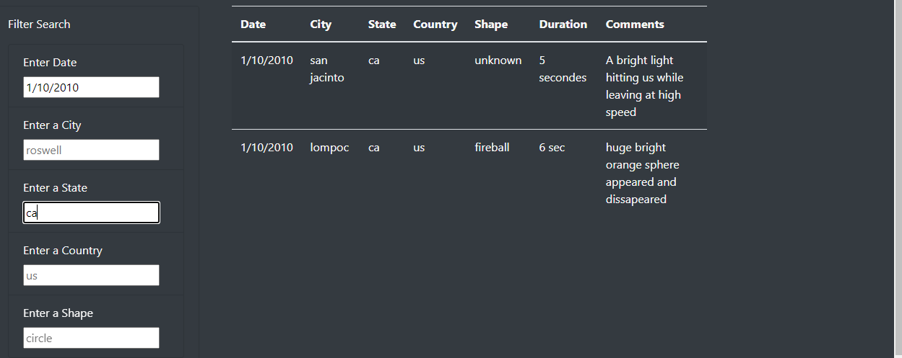
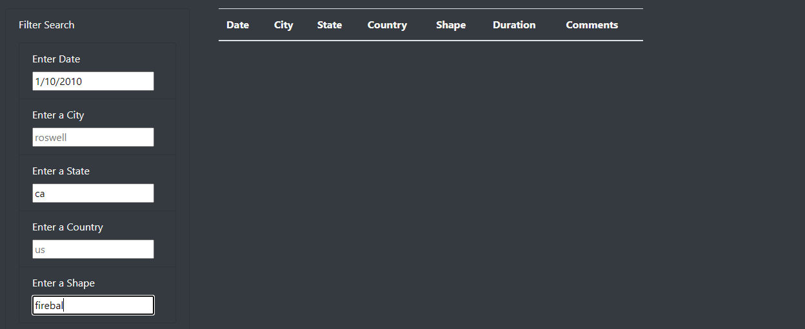

# UFOs

## Overview of Project
#### For this project, our goal was to create a website which would include a dataset of UFO sightings using HTML, Javascript, CSS, and bootstrap elements. The sightings could be filtered by 5 categories (Date / City / State / Country / Shape) based on user inputs for the multiple criteria. 

## Results

#### When someone first visits the webpage, they will see the full dataset sorted by date:

#### Using 1/10/2010 as date filter, the full dataset is pared down:

#### Adding a state filter reduces the number of results even further giving us only 2 sightings in the state of California on 1/10/2010:

## Summary
- A noted drawback is a lack of an error message when there is no results (if the user does not type in the search criteria exactly). 

- This drawback could be solved by including an error message along the lines of "No results found"
- It might be easier to have some of the filters as a drop down listing dates or states or shapes that the user can click instead of typing. This would decrease the amount of 0 results returned due to typos in dates / states / shapes. An example is below with the shape of "fireball" misspelled giving us 0 results when there should be 1.
